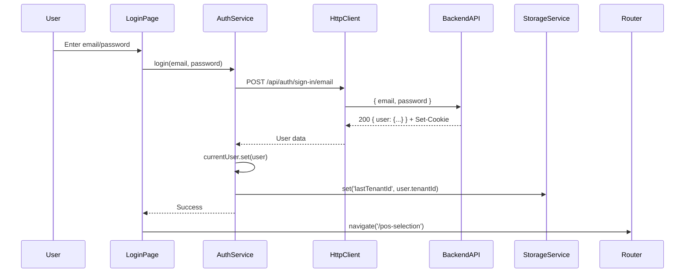
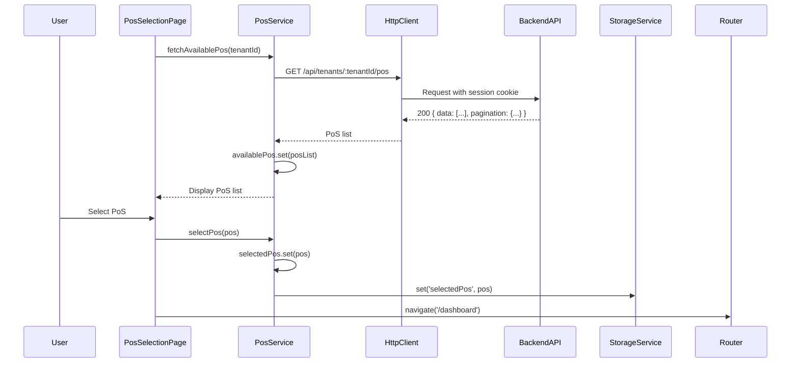
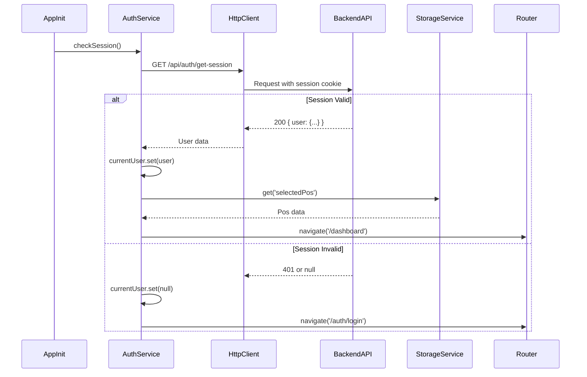

# Technical Specification: Authentication & Authorization Flow

**Feature:** User Authentication, PoS Selection, and Dashboard Access  
**Version:** 1.0  
**Last Updated:** November 1, 2025  
**Status:** Design Complete - Ready for Implementation

---

## 1. High-Level Architecture Overview

### System Architecture

```mermaid
graph TB
    subgraph "Presentation Layer"
        LoginPage[Login Page]
        PosSelectionPage[PoS Selection Page]
        DashboardPage[Dashboard Page]
    end
    
    subgraph "Business Logic Layer"
        AuthService[AuthService]
        PosService[PosService]
        AuthGuard[AuthGuard]
        AuthInterceptor[HTTP Interceptor]
    end
    
    subgraph "Data Layer"
        StorageService[StorageService]
        HttpClient[HttpClient]
    end
    
    subgraph "Backend API"
        AuthAPI[/api/auth/*]
        TenantsAPI[/api/tenants/:tenantId/pos]
    end
    
    LoginPage --> AuthService
    PosSelectionPage --> PosService
    DashboardPage --> AuthService
    DashboardPage --> PosService
    
    AuthService --> StorageService
    AuthService --> HttpClient
    PosService --> HttpClient
    
    AuthGuard --> AuthService
    AuthInterceptor --> AuthService
    
    HttpClient --> AuthAPI
    HttpClient --> TenantsAPI
```

### Architectural Layers

1. **Presentation Layer**: Ionic pages/components for user interaction
2. **Business Logic Layer**: Services, guards, interceptors for auth logic
3. **Data Layer**: HTTP client and storage abstraction
4. **Integration Layer**: Backend API communication via Better Auth session cookies

### Technology Stack

- **Frontend Framework**: Angular 20 (standalone components)
- **Mobile Framework**: Ionic 8
- **State Management**: Angular Signals (stable API)
- **HTTP Client**: Angular HttpClient with interceptors
- **Storage**: Ionic Storage (SQLite driver for mobile)
- **Authentication**: Session-based via Better Auth (backend)
- **Routing**: Angular Router with functional guards

### Module Organization

```
src/app/
├── core/
│   ├── guards/
│   │   └── auth.guard.ts
│   ├── interceptors/
│   │   └── auth.interceptor.ts
│   ├── models/
│   │   ├── user.model.ts
│   │   ├── tenant.model.ts
│   │   └── pos.model.ts
│   └── services/
│       ├── auth.service.ts
│       ├── pos.service.ts
│       └── storage.service.ts
├── features/
│   ├── auth/
│   │   └── login/
│   │       ├── login.page.ts
│   │       ├── login.page.html
│   │       └── login.page.scss
│   ├── pos-selection/
│   │   ├── pos-selection.page.ts
│   │   ├── pos-selection.page.html
│   │   └── pos-selection.page.scss
│   └── dashboard/
│       ├── dashboard.page.ts
│       ├── dashboard.page.html
│       └── dashboard.page.scss
└── shared/
    ├── components/
    └── utils/
```

---

## 2. Key Components and Their Interactions

### Core Services

#### AuthService
**Responsibility**: Centralized authentication state and session management

**Key Capabilities**:
- Manages user authentication state using Angular Signals
- Handles login/logout operations
- Provides session restoration on app launch
- Exposes reactive authentication state to components and guards

**Signals**:
- `currentUser: WritableSignal<User | null>` - Current authenticated user
- `isAuthenticated: Signal<boolean>` - Computed from currentUser
- `isLoading: WritableSignal<boolean>` - Loading state for auth operations

**Methods**:
- `login(email: string, password: string): Observable<User>`
- `logout(): Observable<void>`
- `checkSession(): Observable<User | null>`
- `clearSession(): void`

---

#### PosService
**Responsibility**: Point of Sale selection and management

**Key Capabilities**:
- Fetches available PoS locations for authenticated user
- Manages current PoS selection
- Persists PoS selection across sessions

**Signals**:
- `availablePos: WritableSignal<Pos[]>` - List of available PoS locations
- `selectedPos: WritableSignal<Pos | null>` - Currently selected PoS
- `isLoading: WritableSignal<boolean>` - Loading state

**Methods**:
- `fetchAvailablePos(tenantId: string): Observable<Pos[]>`
- `selectPos(pos: Pos): void`
- `clearSelection(): void`
- `getSelectedPos(): Pos | null`

---

#### StorageService
**Responsibility**: Abstraction layer over Ionic Storage

**Key Capabilities**:
- Unified API for persisting/retrieving app state
- Handles encryption for sensitive data (if needed)
- Provides type-safe storage operations

**Methods**:
- `set<T>(key: string, value: T): Promise<void>`
- `get<T>(key: string): Promise<T | null>`
- `remove(key: string): Promise<void>`
- `clear(): Promise<void>`

---

### Guards

#### AuthGuard
**Type**: Functional guard (`canActivate`)

**Responsibility**: Protect routes requiring authentication

**Logic**:
1. Check `AuthService.isAuthenticated()` signal
2. If authenticated → allow navigation
3. If not authenticated → redirect to `/auth/login`
4. Return `UrlTree` for navigation or `boolean` for access

---

### Interceptors

#### AuthInterceptor
**Type**: HTTP Interceptor

**Responsibility**: Handle session cookies and 401 responses

**Behavior**:
1. Add `withCredentials: true` to all API requests to domain
2. Intercept 401 responses:
   - Clear auth state via `AuthService.clearSession()`
   - Redirect to login page
   - Show optional toast notification
3. Skip interceptor for login/signup endpoints to prevent loops

---

### Pages/Components

#### LoginPage
- Email/password input form
- Form validation (required fields, email format)
- Login button (disabled during loading)
- Error message display
- "Forgot password" link (future scope)

#### PosSelectionPage
- List/grid of available PoS locations
- Selection UI (radio buttons or cards)
- "Continue" button
- Loading state while fetching PoS data
- Empty state if no PoS assigned

#### DashboardPage
- Display current user information
- Display selected PoS information
- Navigation to other app sections (future)
- Logout button

---

## 3. Data Flow and APIs Involved

### Authentication Flow



### PoS Selection Flow



### Session Restoration Flow



### API Endpoints

| Endpoint | Method | Purpose | Request Body | Response | Auth Required |
|----------|--------|---------|--------------|----------|---------------|
| `/api/auth/sign-in/email` | POST | Authenticate user | `{ email: string, password: string }` | `{ user: {...} }` + session cookie | No |
| `/api/auth/get-session` | GET | Check current session | None | `{ user: {...} }` or `null` | No |
| `/api/auth/sign-out` | POST | Logout user | `{}` | Empty + clear cookie | Yes |
| `/api/tenants` | GET | Get user's tenants | None | `{ data: [...] }` | Yes |
| `/api/tenants/:tenantId/pos` | GET | Get PoS for tenant | None | `{ data: [...], pagination: {...} }` | Yes |

### Data Models

#### User Model
```typescript
interface User {
  id: string;
  email: string;
  name: string | null;
  createdAt: string;
  updatedAt: string;
}
```

#### Tenant Model
```typescript
interface Tenant {
  id: string;
  name: string;
  role: 'Owner' | 'Employee';
  createdAt: string;
  updatedAt: string;
}
```

#### PoS Model
```typescript
interface Pos {
  id: string;
  name: string;
  slug: string;
  location: string | null;
  settings: Record<string, any> | null;
  createdAt: string;
  updatedAt: string;
}
```

### State Management Approach

**Using Angular Signals for reactive state:**

- **AuthService** maintains user state as signals
- **PosService** maintains PoS selection as signals
- Components subscribe to signals for reactivity
- No global state store (NgRx) - signals provide sufficient reactivity for MVP

### Caching Strategy

- **User Session**: Cached in memory (signal) + session cookie
- **PoS Selection**: Persisted to Ionic Storage, restored on app launch
- **Tenant List**: Fetched once during login, cached in memory
- **Product/Modifier Data**: Cached after PoS selection (future scope)

### Offline Data Handling

**MVP Scope**: No offline support  
**Future Enhancement**: Queue operations when offline, sync when online

---

## 4. Important Design Trade-offs and Justifications

### 1. Session-based Authentication vs JWT Tokens

**Decision**: Use session-based authentication with cookies

**Rationale**:
- Backend uses Better Auth with session cookies
- Simpler mobile implementation (no token refresh logic)
- HttpOnly cookies prevent XSS attacks
- Better Auth handles session management server-side

**Trade-off**: Requires CORS configuration and `withCredentials: true`

---

### 2. Angular Signals vs NgRx

**Decision**: Use Angular Signals for state management

**Rationale**:
- Signals are stable in Angular 20
- Simpler architecture for MVP scope
- Less boilerplate than NgRx
- Sufficient reactivity for auth state
- Easier onboarding for semi-senior developers

**Trade-off**: May need migration to NgRx if state complexity grows significantly

---

### 3. Ionic Storage vs localStorage

**Decision**: Use Ionic Storage with SQLite driver

**Rationale**:
- Cross-platform consistency (iOS, Android, Web)
- More reliable than localStorage on mobile
- Supports larger data sizes
- Better performance on native platforms
- Unified API across platforms

**Trade-off**: Additional dependency and setup complexity

---

### 4. Functional Guards vs Class-based Guards

**Decision**: Use functional guards (`canActivate` function)

**Rationale**:
- Idiomatic in Angular 20
- Less boilerplate
- Easier to test
- Better tree-shaking

**Trade-off**: Slightly less familiar to developers used to class-based guards

---

### 5. Single Tenant Selection vs Multi-tenant

**Decision**: Assume single tenant per user for MVP

**Rationale**:
- PRD indicates employees assigned to one business
- Simplifies initial implementation
- Backend supports multi-tenant, so migration path exists

**Trade-off**: Will require tenant selection UI if multi-tenant support needed

---

### 6. Eager Loading vs Lazy Loading for Auth Module

**Decision**: Eager load auth pages, lazy load dashboard

**Rationale**:
- Login is the entry point - should load fast
- Dashboard and future features lazy loaded to reduce initial bundle
- Auth module is small, minimal impact on bundle size

**Trade-off**: Slightly larger initial bundle vs complexity of lazy-loaded auth

---

## 5. Risks and Mitigation Strategies

### Technical Risks

| Risk | Likelihood | Impact | Mitigation |
|------|-----------|--------|------------|
| Session cookie not sent from mobile app | Medium | High | Ensure `withCredentials: true` is set correctly; test on iOS/Android early |
| CORS issues with backend | Medium | High | Coordinate with backend team to configure CORS headers properly; test cross-domain requests |
| Session expiration without user notice | Medium | Medium | Implement 401 interceptor with user-friendly error message; consider session refresh mechanism |
| PoS data not available for user | Low | Medium | Handle empty state gracefully; show helpful message to contact admin |
| Ionic Storage initialization failure | Low | High | Implement fallback to localStorage; log errors for debugging |

### Integration Risks

| Risk | Likelihood | Impact | Mitigation |
|------|-----------|--------|------------|
| Backend API changes breaking contract | Low | High | Maintain API documentation; use TypeScript interfaces to enforce contracts |
| Better Auth session behavior unexpected | Medium | Medium | Test session lifecycle thoroughly; consult Better Auth docs for edge cases |
| Tenant/PoS relationship misconfigured | Low | Medium | Validate tenant membership before fetching PoS; handle 403 errors gracefully |

### Security Vulnerabilities

| Vulnerability | Risk Level | Countermeasure |
|---------------|-----------|----------------|
| XSS attacks via stored user data | Medium | Sanitize all user-generated content; use Angular's built-in XSS protection |
| Session hijacking | Low | Rely on HttpOnly cookies (backend responsibility); use HTTPS only |
| Credential storage in app | High | Never store passwords; only store non-sensitive session metadata |
| Man-in-the-middle attacks | Medium | Enforce HTTPS; validate SSL certificates (handled by platform) |

### Data Integrity Concerns

- **PoS selection out of sync**: Validate PoS still exists when navigating to dashboard; refresh if needed
- **User session state mismatch**: Always trust backend session; re-validate on critical operations
- **Stale cached data**: Implement cache invalidation strategy for user/PoS data

### Browser/Platform Compatibility

- **iOS WKWebView cookie handling**: Test session cookies thoroughly on iOS
- **Android WebView variations**: Test on multiple Android versions
- **Web browser session**: Ensure web version works identically to mobile

### Dependency Risks

- **Ionic Storage driver availability**: Fallback to localStorage if SQLite unavailable
- **Angular version upgrades**: Pin Angular versions; test thoroughly before upgrading
- **Better Auth API changes**: Monitor backend for breaking changes; version API endpoints

### Contingency Plans

1. **Session Cookie Failure**: Fallback to localStorage-based token storage (requires backend changes)
2. **Ionic Storage Failure**: Use in-memory only storage with warning to user
3. **Backend Unavailable**: Show offline screen with retry option
4. **PoS Not Available**: Allow user to continue without PoS selection, show warning

---

## 6. Implementation Status and Progress

| Component | Status | Assigned | Notes | Completion % |
|-----------|--------|----------|-------|--------------|
| **Core Services** | | | | |
| AuthService | Not Started | - | Implement signal-based state management | 0% |
| PosService | Not Started | - | Implement PoS fetching and selection | 0% |
| StorageService | Not Started | - | Wrap Ionic Storage with type-safe API | 0% |
| **Guards** | | | | |
| AuthGuard | Not Started | - | Functional guard for protected routes | 0% |
| **Interceptors** | | | | |
| AuthInterceptor | Not Started | - | Handle session cookies and 401 responses | 0% |
| **Data Models** | | | | |
| User Model | Not Started | - | TypeScript interface | 0% |
| Tenant Model | Not Started | - | TypeScript interface | 0% |
| PoS Model | Not Started | - | TypeScript interface | 0% |
| **Pages** | | | | |
| LoginPage | Not Started | - | Email/password form with validation | 0% |
| PosSelectionPage | Not Started | - | List of available PoS locations | 0% |
| DashboardPage | Not Started | - | Display user and PoS info | 0% |
| **Routing** | | | | |
| Route Configuration | Not Started | - | Configure auth routes and guards | 0% |
| **Environment** | | | | |
| API Base URL Config | Not Started | - | Add API_URL to environment files | 0% |
| **Storage Setup** | | | | |
| Ionic Storage Config | Not Started | - | Initialize storage in main.ts or app.component | 0% |
| **Testing** | | | | |
| Unit Tests | Not Started | - | Test services, guards, interceptors | 0% |
| E2E Tests | Not Started | - | Test full auth flow | 0% |

**Last Updated**: November 1, 2025

---

## 7. Implementation Phases and Priorities

### Phase 1: Foundation (Priority: Critical)

**Goal**: Set up core infrastructure for authentication

**Deliverables**:
- Environment configuration (API base URL)
- Data models (User, Tenant, PoS interfaces)
- StorageService implementation
- AuthService with signal-based state
- HTTP Interceptor for session cookies and 401 handling

**Dependencies**: None

**Acceptance Criteria**:
- Services are injectable and testable
- Signals update reactively
- Storage persists data correctly
- Interceptor adds `withCredentials: true` to API calls
- 401 responses clear auth state and redirect

**Estimated Effort**: 1-2 days

---

### Phase 2: Authentication Flow (Priority: Critical)

**Goal**: Implement login and logout functionality

**Deliverables**:
- LoginPage with form validation
- Login API integration
- Logout functionality
- Session check on app initialization
- AuthGuard implementation

**Dependencies**: Phase 1 complete

**Acceptance Criteria**:
- User can log in with email/password
- Invalid credentials show error message
- Successful login navigates to PoS selection
- Session is restored on app restart
- User can log out and session is cleared
- Protected routes redirect to login if not authenticated

**Estimated Effort**: 2-3 days

---

### Phase 3: PoS Selection (Priority: Critical)

**Goal**: Implement PoS selection after login

**Deliverables**:
- PosService implementation
- PosSelectionPage with list/grid UI
- PoS API integration
- PoS selection persistence
- Navigation to dashboard after selection

**Dependencies**: Phase 2 complete

**Acceptance Criteria**:
- User sees list of assigned PoS locations
- User can select a PoS
- Selection is persisted across sessions
- Selected PoS is available in PosService signal
- User navigates to dashboard after selection
- Empty state shown if no PoS available

**Estimated Effort**: 1-2 days

---

### Phase 4: Dashboard (Priority: Critical)

**Goal**: Display user and PoS information on dashboard

**Deliverables**:
- DashboardPage implementation
- Display current user details
- Display selected PoS details
- Logout button

**Dependencies**: Phase 3 complete

**Acceptance Criteria**:
- Dashboard shows user name, email
- Dashboard shows selected PoS name, location
- Logout button clears session and returns to login
- Dashboard is protected by AuthGuard

**Estimated Effort**: 0.5-1 day

---

### Phase 5: Routing & Navigation (Priority: High)

**Goal**: Configure complete routing structure

**Deliverables**:
- Update `app.routes.ts` with auth routes
- Apply AuthGuard to protected routes
- Configure redirects (authenticated → dashboard, unauthenticated → login)
- Handle deep linking and back navigation

**Dependencies**: Phases 1-4 complete

**Acceptance Criteria**:
- Login page is public
- PoS selection requires authentication
- Dashboard requires authentication and PoS selection
- Direct navigation to protected routes redirects appropriately
- Back button navigation works correctly

**Estimated Effort**: 0.5 day

---

### Phase 6: Error Handling & UX Polish (Priority: Medium)

**Goal**: Improve error handling and user experience

**Deliverables**:
- Loading spinners during API calls
- Error messages for network failures
- Toast notifications for success/error states
- Form validation feedback
- Retry mechanisms for failed requests

**Dependencies**: Phases 1-5 complete

**Acceptance Criteria**:
- Loading indicators shown during async operations
- Network errors show user-friendly messages
- Form validation provides clear feedback
- User can retry failed operations
- Success/error toasts are non-intrusive

**Estimated Effort**: 1 day

---

### Phase 7: Testing (Priority: High)

**Goal**: Ensure code quality and reliability

**Deliverables**:
- Unit tests for services (AuthService, PosService, StorageService)
- Unit tests for guards and interceptors
- Component tests for pages
- E2E test for full auth flow

**Dependencies**: Phases 1-6 complete

**Acceptance Criteria**:
- 80%+ code coverage on services
- All guards and interceptors tested
- Critical user flows covered by E2E tests
- Tests pass in CI/CD pipeline

**Estimated Effort**: 2-3 days

---

### Future Enhancements (Post-MVP)

- **Multi-tenant Support**: Allow user to switch between multiple tenants
- **Remember Me**: Persist login across app restarts
- **Biometric Authentication**: Touch ID / Face ID support
- **Password Reset**: Forgot password flow
- **Session Refresh**: Auto-refresh session before expiration
- **Offline Mode**: Queue auth-related operations when offline

---

## Success Metrics and Acceptance Criteria

### MVP Success Criteria

- ✅ User can log in with email/password
- ✅ User session persists across app restarts
- ✅ User can select assigned PoS location
- ✅ PoS selection persists across app restarts
- ✅ Dashboard displays user and PoS information
- ✅ User can log out
- ✅ Protected routes are inaccessible without authentication
- ✅ 401 responses clear session and redirect to login
- ✅ Works on iOS, Android, and Web

### Performance Metrics

- Login API response < 2s (95th percentile)
- PoS fetch API response < 1s (95th percentile)
- Page navigation < 300ms
- Session restoration < 1s

### Security Metrics

- No passwords stored in app
- No session tokens in localStorage
- All API calls use HTTPS
- Session cookies are HttpOnly (backend responsibility)

---

## Deployment and Rollout Plan

1. **Development Environment**: Test all flows locally
2. **Staging Environment**: Test with staging backend API
3. **QA Testing**: Manual testing on iOS and Android devices
4. **Beta Release**: Limited rollout to test users
5. **Production Release**: Full rollout after validation

---

## Appendix: Configuration Examples

### Environment Configuration

**`src/environments/environment.ts`**:
```typescript
export const environment = {
  production: false,
  apiUrl: 'http://localhost:3000' // Local dev backend
};
```

**`src/environments/environment.prod.ts`**:
```typescript
export const environment = {
  production: true,
  apiUrl: 'https://api.cartaya.app' // Production backend
};
```

### Ionic Storage Configuration

**`src/main.ts`** (or dedicated storage config):
```typescript
// Initialize Ionic Storage in app.component or main.ts provider
{
  provide: APP_INITIALIZER,
  useFactory: (storage: Storage) => () => storage.create(),
  deps: [Storage],
  multi: true
}
```

### HTTP Interceptor Registration

**`src/main.ts`**:
```typescript
bootstrapApplication(AppComponent, {
  providers: [
    provideHttpClient(
      withInterceptors([authInterceptor])
    ),
    // ... other providers
  ]
});
```

---

**End of Technical Specification**
